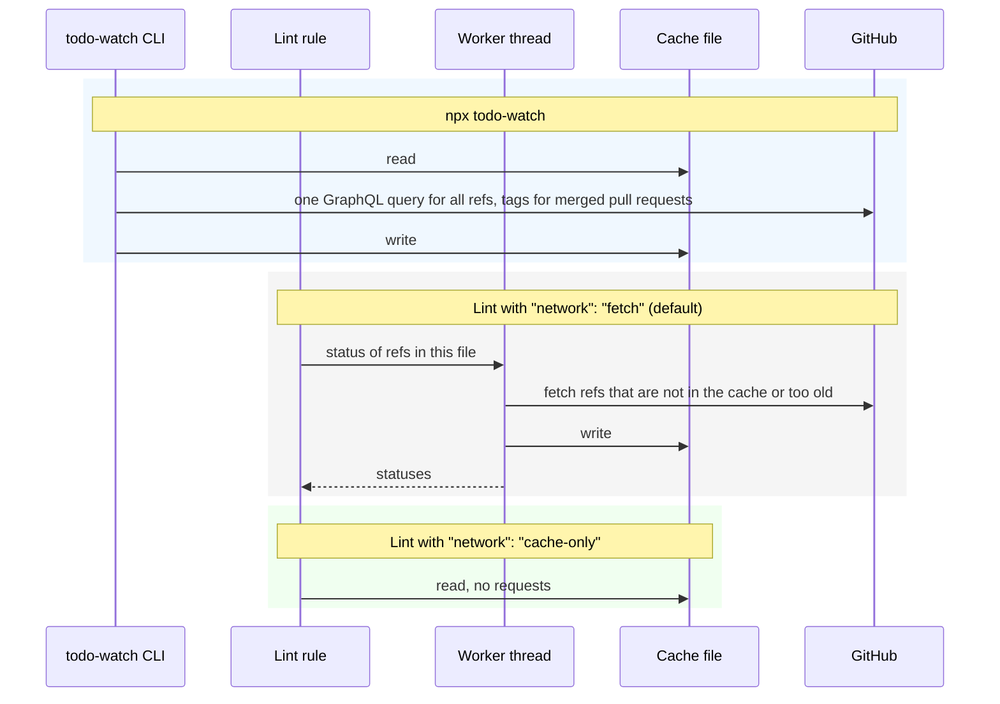

<div align="center">

<picture>
  <source media="(prefers-color-scheme: dark)" srcset="assets/logo-dark.png" />
  <source media="(prefers-color-scheme: light)" srcset="assets/logo-light.png" />
  
</picture>

<p align="center">Watch GitHub issues and PRs linked in TODO comments</p>
<p align="center">
  <a href="https://www.npmjs.com/package/todo-watch" alt="todo-watch"></a> <a href="https://github.com/zirkelc/todo-watch/actions/workflows/ci.yml" alt="CI"></a>
</p>

</div>

This library reads `TODO(...)` comments that link a GitHub issue or pull request, and reports when the linked issue or pull request changes: it is closed or merged, it gets new comments, a pull request is linked, or a fix is released. It is a command line tool, a plugin for [Oxlint JS plugins](https://oxc.rs/docs/guide/usage/linter/js-plugins) and [ESLint](https://eslint.org/docs/latest/use/configure/plugins), and a small API.

## Why?

You link an upstream issue or pull request next to a workaround, and then you forget it. However, you want to know when:

- **A fix lands**: The upstream pull request is merged, or it is contained in a release, so the workaround can go
- **An issue is resolved**: It is closed as completed, as not planned, or as a duplicate of another issue
- **Something new happens**: New comments, a reopen, an approval, or a pull request that will close the issue
- **A link goes bad**: The repo was renamed, the issue was transferred, or it does not exist

This library checks all linked references when you ask for it, or during your normal lint run, and tells you only what changed since you last looked.

## Installation

```bash
npm install --save-dev todo-watch
```

Or run it without installation:

```bash
npx todo-watch
```

The checks need a GitHub token. They use `GITHUB_TOKEN` or `GH_TOKEN`. If neither is set, they ask the [GitHub CLI](https://cli.github.com/) with `gh auth token`.

## How It Works

The CLI and the lint rules run the same checks and share one cache file. The CLI fetches all references with batched GraphQL requests and writes the cache. The lint rules either fetch too, or only read the cache that the CLI wrote.



## Usage

Link an issue or pull request in a `TODO` comment:

```ts
// TODO(https://github.com/vitest-dev/vitest/issues/11363): remove this workaround
export const pool = 'forks';
```

Run the CLI. `--fix` adds the `seen` marker that records when you last looked:

```bash
npx todo-watch --fix
```

```ts
// TODO(https://github.com/vitest-dev/vitest/issues/11363 seen=2026-09-28T10:03Z): remove this workaround
```

From then on, `npx todo-watch` reports what happens upstream:

```
src/b.ts:1:9  warning  activity
  vitest-dev/vitest#11376 "docs: document cwd behavior on projects" was updated since 2025-01-01T00:00Z: ready for review, approved by AriPerkkio.
  URL: https://github.com/vitest-dev/vitest/pull/11376
  Next: read the news and update the code if needed. Then mark it as seen: replace "seen=2025-01-01T00:00Z" with "seen=2026-09-28T11:18Z", or run `todo-watch --mark-seen --ref vitest-dev/vitest#11376`.

src/b.ts:3:10  warning  resolved
  oxc-project/oxc#27134 "refactor(ast)!: remove unused `CallExpression::is_symbol_or_symbol_for_call`" was merged on 2026-09-28, not released yet.
  URL: https://github.com/oxc-project/oxc/pull/27134
  Next: keep the workaround until a release contains the fix. Then upgrade and remove the TODO and its workaround.

2 problems (0 errors, 2 warnings) in 2 references.
```

### The TODO Format

Only references inside the parentheses of a keyword are checked. A plain link in a comment, or `TODO(username)`, is ignored. A reference is a full URL or the short form `owner/repo#123`. A URL can contain any path or hash that GitHub adds, and it is kept as it is.

```ts
/** A full URL is clickable in the editor. The hash is kept. */
// TODO(https://github.com/vitest-dev/vitest/issues/11363#issuecomment-5866925885 seen=2026-09-28T10:03Z)

/** The short form. */
// FIXME(vitest-dev/vitest#11363 seen=2026-09-28T10:03Z)

/** More than one reference, each with its own seen marker. */
// TODO(vitest-dev/vitest#11363 seen=2026-09-28T10:03Z, oxc-project/oxc#27134 seen=2026-09-28T10:03Z)

/**
 * Block comments work, also over more than one line.
 * TODO(https://github.com/vitest-dev/vitest/pull/11376 seen=2026-09-28T10:03Z): drop the pool option
 */
```

The CLI reads any text file, so the format also works in Markdown, YAML, Python and other files.

### The Seen Marker

`seen=YYYY-MM-DDTHH:MMZ` records when you last reviewed a reference, in UTC with minute precision. The [`activity`](#checks) check reports only what happened after it. The marker is outside the URL, so the link stays clickable and you can paste a new URL without losing it.

```ts
/** Everything in the minute of the marker counts as seen. */
// TODO(vitest-dev/vitest#11363 seen=2026-09-28T10:03Z)
```

To mark new activity as seen, run `todo-watch --mark-seen`, apply the "Mark as seen" suggestion in your editor, or run `oxlint --fix-suggestions`. They write the time at which the status was fetched, not the current time, so nothing that happened after the fetch is lost.

> [!IMPORTANT]
> `--fix` never marks activity as seen, because you should read it first. Do not put `--mark-seen` or `--fix-suggestions` in a pre-commit hook.

### Checks

The CLI and the lint plugin run the same four checks. In the lint plugin, each check is a rule.

| Check      | Network | Severity | What it reports                                                     | Fix                                                  |
| ---------- | ------- | -------- | ------------------------------------------------------------------- | ---------------------------------------------------- |
| `format`   | no      | `error`  | Invalid references and seen markers                                 | Adds a missing seen marker, expands short references |
| `invalid`  | yes     | `error`  | References that do not exist or have moved, and GitHub errors       | Updates moved references                             |
| `resolved` | yes     | `warn`   | Closed issues and merged or closed pull requests                    | Suggests the issue that a duplicate points to        |
| `activity` | yes     | `warn`   | New activity on open issues and pull requests since the seen marker | Marks as seen with `--mark-seen`                     |

`resolved` reports a reference until you remove or change the TODO. A seen marker does not hide it.

| Target       | State                 | Message                                                                            |
| ------------ | --------------------- | ---------------------------------------------------------------------------------- |
| Issue        | Closed as completed   | `closed as completed on <date> by <merged pull requests and their release>`        |
| Issue        | Closed as not planned | `closed as not planned on <date>`                                                  |
| Issue        | Closed as duplicate   | `closed as a duplicate of <issue> on <date>`, with a suggestion to link that issue |
| Pull request | Merged                | `merged on <date>, released in <tag>` or `not released yet`                        |
| Pull request | Closed without merge  | `closed without merge on <date>`                                                   |

`activity` reports what happened on an open issue or pull request after its seen marker, in one message per reference.

| Target                 | Activity                                                                                                       |
| ---------------------- | -------------------------------------------------------------------------------------------------------------- |
| Issue and pull request | New comments (with the first one as an excerpt), reopened                                                      |
| Issue                  | Linked to a pull request that will close it, linked pull request merged (with release) or closed without merge |
| Pull request           | Ready for review, converted to draft, approved, changes requested                                              |
| Both, with `include`   | Labels added, milestone set                                                                                    |

### CLI

`todo-watch [options] [paths...]` checks all tracked and not ignored files below the paths. Paths default to the current directory. `node_modules` is always skipped.

```bash
npx todo-watch                                    # all files
npx todo-watch src docs                           # only these paths
npx todo-watch --ref vitest-dev/vitest#11363      # only this reference
npx todo-watch --rules resolved,activity          # only these checks
npx todo-watch --format json                      # for agents and scripts
npx todo-watch --format markdown                  # for a pull request comment or an issue
npx todo-watch --fix                              # add seen markers, update moved references
npx todo-watch --mark-seen --ref vitest-dev/vitest#11363
```

| Option                    | Default      | Description                                                           |
| ------------------------- | ------------ | --------------------------------------------------------------------- |
| `--format <format>`       | `text`       | `text`, `json` or `markdown`                                          |
| `--quiet`                 | off          | Report errors only                                                    |
| `--compact`               | off          | Print only the first line of each message                             |
| `--fail-on <level>`       | `error`      | Exit with `1` on `error`, `warn` or `none`                            |
| `--rules <list>`          | all          | Checks to run                                                         |
| `--ref <owner/repo#123>`  | all          | Check only this reference. Can be repeated                            |
| `--keywords <list>`       | `TODO,FIXME` | Comment keywords                                                      |
| `--fix`                   | off          | Add missing seen markers, update moved references                     |
| `--mark-seen`             | off          | Mark new activity as seen. Use `--ref` to limit it                    |
| `--ignore-authors <list>` | `bots`       | Logins to ignore, plus the presets `bots` and `self` (the token user) |
| `--include <list>`        | none         | Also report `labels` and `milestones`                                 |
| `--wait-for-release`      | off          | Report merged pull requests only when a release contains them         |
| `--expand-short-refs`     | off          | Report short references. `--fix` replaces them with URLs              |
| `--cache-ttl <minutes>`   | `60`         | How long fetched statuses stay valid                                  |
| `--no-cache`              | off          | Fetch all statuses again                                              |

The exit code is `0` if nothing is reported at or above `--fail-on`, `1` if something is, and `2` for invalid options. Changes from `--fix` and `--mark-seen` are counted on stderr, so `--format json` keeps stdout clean.

The CLI has no config file. Put the options you always use into a script:

```json
{
  "scripts": {
    "todos": "todo-watch --keywords TODO,FIXME,HACK --ignore-authors bots,self --wait-for-release"
  }
}
```

### Lint Plugin

Add the plugin to `.oxlintrc.json` and enable the rules:

```jsonc
{
  "jsPlugins": ["todo-watch/oxlint"],
  "rules": {
    "todo-watch/format": "error",
    "todo-watch/invalid": "error",
    "todo-watch/resolved": "warn",
    // ignoreAuthors defaults to ["bots"], include defaults to []
    "todo-watch/activity": ["warn", { "ignoreAuthors": ["bots", "self"], "include": ["labels"] }],
  },
}
```

The rule options match the CLI options:

| Rule                  | Option              | Default    | CLI option            |
| --------------------- | ------------------- | ---------- | --------------------- |
| `todo-watch/format`   | `expandShortRefs`   | `false`    | `--expand-short-refs` |
| `todo-watch/invalid`  | `reportUnavailable` | `true`     | none                  |
| `todo-watch/resolved` | `waitForRelease`    | `false`    | `--wait-for-release`  |
| `todo-watch/activity` | `ignoreAuthors`     | `["bots"]` | `--ignore-authors`    |
| `todo-watch/activity` | `include`           | `[]`       | `--include`           |

`reportUnavailable` reports once per file if GitHub cannot be reached or no token is found. In the editor, "Mark as seen" is a suggestion of the `activity` rule. `oxlint --fix` applies only the fixes of `format` and `invalid`.

Settings are shared by all rules:

```jsonc
{
  "settings": {
    "todo-watch": {
      // network defaults to "fetch". "cache-only" reads the cache that the CLI wrote, "off" skips GitHub.
      "network": "fetch",
      // keywords defaults to ["TODO", "FIXME"]
      "keywords": ["TODO", "FIXME", "HACK"],
      // cacheTtl defaults to 60 (minutes)
      "cacheTtl": 30,
      // prefetch defaults to true
      "prefetch": true,
      // verbose defaults to true
      "verbose": true,
    },
  },
}
```

### Fast Linting

With `"network": "fetch"`, the first lint run without cache waits a few seconds for GitHub, and the editor waits too. To keep linting as fast as without the plugin, let the lint rules read only the cache, and refresh the cache with the CLI when you want new statuses:

```jsonc
{
  "jsPlugins": ["todo-watch/oxlint"],
  "settings": { "todo-watch": { "network": "cache-only" } },
}
```

```bash
npx todo-watch   # fetches all references and fills the cache that the lint rules read
```

In `cache-only` mode, a reference that is not in the cache gets no status report. The `format` rule still checks it. `"network": "off"` turns off the three network rules completely.

### ESLint

The plugin uses the standard rule API, so it also works in ESLint 9 with flat config. `configs.recommended` enables all four rules with the severities from the [checks table](#checks).

```js
import todoWatch from 'todo-watch/eslint';

export default [todoWatch.configs.recommended];
```

### Messages for Agents

Lint and CLI runs are often done by coding agents, so every message carries enough context to act without opening GitHub first. The first line names the reference with its title and says what changed. The next lines give the first new comment (as an excerpt of 200 characters), the URL, and the next step, with the exact text to write for the seen marker. For scripts, `--format json` gives the same content as fields.

```jsonc
{
  "settings": {
    // verbose defaults to true. false keeps only the first line of each lint message.
    "todo-watch": { "verbose": false },
  },
}
```

> [!NOTE]
> Oxlint's default reporter prints each message on one line. The detail lines then follow the first line, separated by spaces. Use `--format=stylish` to see them on their own lines. ESLint and the CLI always print them on their own lines.

## Advanced

### Cache

Statuses are cached in `node_modules/.cache/todo-watch/github.json`, or in the temp directory if the project has no `node_modules`. They stay valid for `cacheTtl` minutes (`--cache-ttl` in the CLI). "Not found" results are cached too. Network and token errors are not cached, and a long-running editor session retries them after one minute. A release that contains a merge commit is cached forever.

> [!TIP]
> In CI, cache `node_modules/.cache/todo-watch` between runs. Otherwise every CI run fetches all references once.

### Prefetch

With `prefetch`, the first file with a reference in a lint run triggers a scan of all JavaScript and TypeScript files in the project, and all references are fetched at once. A cold run then takes seconds instead of one request per file. Set `prefetch` to `false` if you lint only a few files of a very large repository. The CLI always fetches all references of the checked files at once.

### Releases

For a merged pull request, the 50 newest tags of the repo are loaded. The compare API then finds the oldest tag after the merge that contains the merge commit. At most 5 tags are checked.

> [!NOTE]
> If the merge is older than all 50 tags, the first release cannot be found. It is then reported as `released in <tag> or earlier`. In a monorepo, the tag can belong to a different package than the one you use.

### Limitations

> [!IMPORTANT]
>
> - Only GitHub.com is supported. GitHub Enterprise, GitLab, and Jira references are ignored.
> - Only the last 50 comments and the last 100 timeline events of each issue are fetched. On very busy issues, older activity after the seen marker can be missed.
> - The lint plugin checks only JavaScript and TypeScript files, because Oxlint JS plugins run only on those. The CLI checks all text files.
> - The CLI reads keywords in any text, not only in comments. A `TODO(owner/repo#123)` inside a string is checked too.

## API

### `check(options?)`

```ts
function check(options?: CheckOptions): Promise<CheckResult>;
```

Runs the checks of the CLI and returns the findings of each file. `paths` defaults to `['.']`, `rules` to all checks, `keywords` to `['TODO', 'FIXME']`, and `cacheTtl` to `60` minutes. Offsets in the findings refer to the text of the file.

```ts
import { check, formatMessage } from 'todo-watch';

const result = await check({ paths: ['src'], rules: ['resolved'], resolved: { waitForRelease: true } });

for (const file of result.files) {
  for (const finding of file.findings) console.log(file.path, formatMessage(finding, true));
}
```

### `parseTodos(text, keywords?)`

```ts
function parseTodos(text: string, keywords?: Array<string>): Array<TodoComment>;
// parseTodos('TODO(o/r#1 seen=2026-09-28T10:03Z)')[0].entries[0].ref: { kind: 'short', owner: 'o', repo: 'r', number: 1, ... }
```

Finds all `KEYWORD(...)` occurrences in a text and parses their entries. Offsets are relative to `text`. `keywords` defaults to `['TODO', 'FIXME']`.

### `parseRef(token)`

```ts
function parseRef(token: Token): TodoRef | undefined;
// parseRef({ text: 'https://github.com/o/r/pull/2/files', start: 0, end: 35 }): { kind: 'url', owner: 'o', repo: 'r', number: 2, ... }
// parseRef({ text: 'o/r', start: 0, end: 3 }): undefined
```

Parses a full URL or a short reference.

### `parseSeen(value)` / `formatSeen(date)`

```ts
function parseSeen(value: string): Date | undefined;
function formatSeen(date: Date): string;
// parseSeen('2026-02-30T10:00Z'): undefined
// formatSeen(new Date('2026-09-28T10:03:59Z')): '2026-09-28T10:03Z'
```

Parse and format the value of a seen marker, with minute precision in UTC.

### `toRefUrl(ref)`

```ts
function toRefUrl(ref: { owner: string; repo: string; number: number }): string;
// toRefUrl({ owner: 'o', repo: 'r', number: 1 }): 'https://github.com/o/r/issues/1'
```

### `formatMessage(finding, verbose)`

```ts
function formatMessage(finding: Pick<Finding, 'summary' | 'details'>, verbose: boolean): string;
```

Builds the message text as the lint rules print it. Without `verbose`, only the first line is kept.

### Plugin: default export

```ts
import todoWatch from 'todo-watch/oxlint'; // or 'todo-watch/eslint'
// todoWatch: TodoWatchPlugin
```

The plugin with all four rules and `configs.recommended`. Both subpaths export the same plugin.

### Plugin: `createPlugin(provider)`

```ts
function createPlugin(provider: StatusProvider): TodoWatchPlugin;
```

Creates the plugin with your own status provider, for example to test your config without network access. The provider is called once per file with all references of that file. It returns a result for each reference, keyed by the lowercased `owner/repo#number`.

```ts
import { createPlugin } from 'todo-watch/oxlint';

const offline = createPlugin((request) =>
  Object.fromEntries(
    request.refs.map((ref) => [
      `${ref.owner}/${ref.repo}#${ref.number}`.toLowerCase(),
      { ok: false, reason: 'unavailable', message: 'offline', fetchedAt: new Date().toISOString() },
    ]),
  ),
);
```

### Plugin: `recommendedRules`

```ts
const recommendedRules: {
  'todo-watch/format': 'error';
  'todo-watch/invalid': 'error';
  'todo-watch/resolved': 'warn';
  'todo-watch/activity': 'warn';
};
```

The rule severities of `configs.recommended`, to spread into your own config.

## Types

### `CheckOptions`

```ts
import type { CheckOptions, CheckResult, FileReport, Finding } from 'todo-watch';
// CheckOptions: { cwd?; paths?; rules?; refs?; keywords?; cacheTtl?; format?; resolved?; activity?; now?; getStatuses? }
// CheckResult: { files: Array<FileReport>; refCount: number }
// FileReport: { path: string; text: string; findings: Array<Finding> }
// Finding: { rule; messageId; summary: string; details: Array<string>; token: Token; ref?: TodoRef; fix?: Edit; suggestion?: { messageId; description; edit: Edit } }
```

### Check options

```ts
import type { ActivityOptions, FormatOptions, InvalidOptions, ResolvedOptions } from 'todo-watch';
// FormatOptions: { expandShortRefs: boolean }
// InvalidOptions: { reportUnavailable: boolean }
// ResolvedOptions: { waitForRelease: boolean }
// ActivityOptions: { ignoreAuthors: Array<string>; include: Array<'labels' | 'milestones'> }
```

### `TodoWatchSettings`

```ts
import type { NetworkMode, TodoWatchSettings } from 'todo-watch/oxlint';
// TodoWatchSettings: { keywords: Array<string>; cacheTtl: number; prefetch: boolean; verbose: boolean; network: NetworkMode }
// NetworkMode: 'fetch' | 'cache-only' | 'off'
```

### `StatusProvider`

```ts
import type { StatusProvider } from 'todo-watch/oxlint';
import type { StatusRequest, StatusResult } from 'todo-watch';
// StatusProvider: (request: StatusRequest) => Record<string, StatusResult>
// StatusRequest: { refs: Array<RefId>; cwd: string; keywords: Array<string>; cacheTtl: number; prefetch: boolean; cacheOnly?: boolean }
// StatusResult:
//   | { ok: true; status: IssueStatus | PullRequestStatus; viewer: string | undefined; fetchedAt: string }
//   | { ok: false; reason: 'not-found' | 'unavailable'; message: string; fetchedAt: string }
```

### Parsed comments

```ts
import type { SeenMarker, Token, TodoComment, TodoEntry, TodoRef } from 'todo-watch';
// Token: { text: string; start: number; end: number }
// TodoComment: Token & { keyword: string; entries: Array<TodoEntry> }
// TodoEntry: Token & { ref: TodoRef | undefined; seen: SeenMarker | undefined; unknown: Array<Token> }
// TodoRef: Token & { kind: 'url' | 'short'; owner: string; repo: string; number: number }
// SeenMarker: Token & { value: string; date: Date | undefined }
```

## License

MIT
