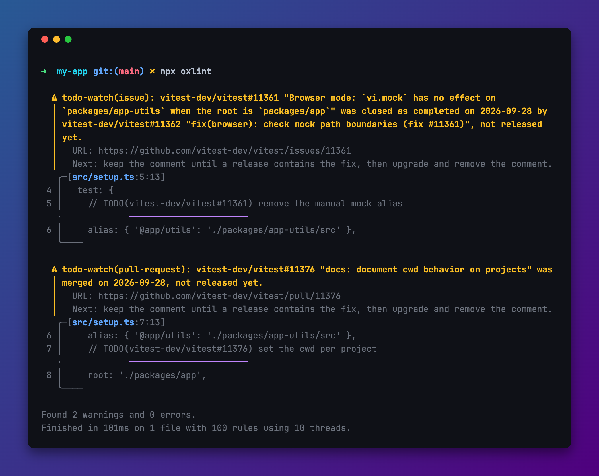

<p align="center">
  
</p>

<div align="center">

<p align="center">Watch GitHub issues and PRs linked in TODO comments</p>
<p align="center">
  <a href="https://www.npmjs.com/package/todo-watch" alt="todo-watch"></a> <a href="https://github.com/zirkelc/todo-watch/actions/workflows/ci.yml" alt="CI"></a>
</p>

</div>

This library checks `TODO(...)` comments that link a GitHub issue or pull request, and tells you when the linked issue is closed or the linked pull request is merged. You can use it in two ways:

- **Standalone:** run `npx todo-watch` when you want to know what changed, by hand, in CI, or from a coding agent.
- **As lint rules:** add it to [Oxlint](https://oxc.rs/docs/guide/usage/linter/js-plugins) or [ESLint](https://eslint.org/docs/latest/use/configure/plugins), and see the status of each linked issue in your editor and lint output.

Both ways run the same checks, print the same messages, and share one cache.

## Why?

You link an upstream issue or pull request in a comment, and then you forget about it. However, you want to know when:

- **A fix landed**: The pull request is merged, or it is contained in a release
- **An issue is resolved**: It is closed, marked as completed or not planned
- **A linked fix is merged**: The issue is still open, but a pull request that closes it was merged

This library reports these states for every linked reference, with the next step to take.

## Installation

```bash
npm install --save-dev todo-watch
```

For the standalone CLI, you can also run it without installation: `npx todo-watch`.

A GitHub token is needed to read issues and pull requests. It is read from `GITHUB_TOKEN` or `GH_TOKEN`. If neither is set, it is read from the [GitHub CLI](https://cli.github.com/) with `gh auth token`.

## Usage

### The TODO Format

Put a GitHub reference in the parentheses of a `TODO` comment. The reference is a full URL, as you copy it from the browser, the short form `owner/repo#123`, or `#123` for an issue in your own repository:

```ts
// TODO(https://github.com/vitest-dev/vitest/issues/11361): remove the manual mock alias
export const alias = { '@app/utils': './packages/app-utils/src' };
```

Nothing else is needed. Existing comments in this format are checked as they are. To also check other keywords like `FIXME` or `HACK`, use `--keywords` in the CLI or the `keywords` setting.

```ts
/** Full URL with its path and hash, and it stays clickable in the editor. */
// TODO(https://github.com/vitest-dev/vitest/issues/11363#issuecomment-5866925885)

/** Short form. */
// TODO(vitest-dev/vitest#11363)

/** An issue or pull request in the repository of your current project. */
// TODO(#42)

/** More than one reference. */
// TODO(vitest-dev/vitest#11363, oxc-project/oxc#27134)

/** Skipped: a TODO without a GitHub reference, or a plain link. */
// TODO(zirkelc): clean up
// See https://github.com/vitest-dev/vitest/issues/11363
```

**Your repository** for `#123` is found in this order: the `repo` setting or the `--repo` option, the git remote `upstream`, the git remote `origin`, and the `repository` field in `package.json`. `upstream` comes first because in a fork, the issues live in the upstream repository.

### Standalone CLI

Run the CLI in your project. It checks all tracked files in the git repository, in any language, including Markdown:

```bash
npx todo-watch
```

```
src/alias.ts:1:9  warning  issue
  vitest-dev/vitest#11361 "Browser mode: `vi.mock` has no effect on `packages/app-utils` when the root is `packages/app`" was closed as completed on 2026-09-28 by vitest-dev/vitest#11362 "fix(browser): check mock path boundaries (fix #11361)", not released yet.
  URL: https://github.com/vitest-dev/vitest/issues/11361
  Next: keep the comment until a release contains the fix, then upgrade and remove the comment.

src/reporter.ts:3:9  warning  pull-request
  oxc-project/oxc#27134 "refactor(ast)!: remove unused `CallExpression::is_symbol_or_symbol_for_call`" was merged on 2026-09-28, not released yet.
  URL: https://github.com/oxc-project/oxc/pull/27134
  Next: keep the comment until a release contains the fix, then upgrade and remove the comment.

2 problems (0 errors, 2 warnings) in 2 references.
```

The commands you use most:

```bash
npx todo-watch --fix                    # update moved references
npx todo-watch src docs                 # check only these paths
npx todo-watch --wait-for-release       # report fixes only when they are released
npx todo-watch --format json            # for agents and scripts
npx todo-watch --format markdown        # for a pull request comment or an issue
```

The exit code is `0` without errors, `1` with errors, and `2` for invalid options. Use `--fail-on warn` to also fail on warnings. All options are listed in [CLI Options](#cli-options).

### Lint Plugin

Add the plugin to `.oxlintrc.json` and enable the rules:

```json
{
  "jsPlugins": ["todo-watch/oxlint"],
  "rules": {
    "todo-watch/invalid": "error",
    "todo-watch/issue": "warn",
    "todo-watch/pull-request": "warn"
  }
}
```

For ESLint 9, use the recommended config, which enables the same four rules:

```js
import todoWatch from 'todo-watch/eslint';

export default [todoWatch.configs.recommended];
```

The rules show the same messages as the CLI. `oxlint --fix` updates moved references.

> [!NOTE]
> Oxlint JS plugins run only on JavaScript and TypeScript files. To also check references in Markdown or other files, use the CLI.

### Using Both

By default, the lint rules fetch statuses from GitHub themselves. The first lint run without a cache then waits a few seconds for GitHub, and so does the editor. To keep linting as fast as without the plugin, let the rules read only the cache, and refresh the cache with the CLI when you want new statuses:

```json
{
  "jsPlugins": ["todo-watch/oxlint"],
  "settings": { "todo-watch": { "network": "cache-only" } }
}
```

```bash
npx todo-watch   # fetches all references and fills the cache that the lint rules read
```

| `network`         | Lint rules                                                               |
| ----------------- | ------------------------------------------------------------------------ |
| `fetch` (default) | Fetch statuses that are not in the cache or older than the cache TTL     |
| `cache-only`      | Read the cache only. A reference that is not in the cache gets no status |
| `off`             | No statuses at all. Only `format` reports                                |

## Checks

Four checks run in the CLI. In the lint plugin, each check is a rule with the same name.

| Check                           | Needs GitHub | Severity | Reports                                                   |
| ------------------------------- | ------------ | -------- | --------------------------------------------------------- |
| [`format`](#format)             | no           | `error`  | A reference that cannot be parsed                         |
| [`invalid`](#invalid)           | yes          | `error`  | A reference that does not exist or has moved              |
| [`issue`](#issue)               | yes          | `warn`   | A closed issue, or an open issue with a merged linked fix |
| [`pull-request`](#pull-request) | yes          | `warn`   | A merged pull request, or one closed without merge        |

Use `--rules` in the CLI, or turn rules on and off in your lint config, to run only some checks. Each check reports the current state, so a finding stays until you change or remove the comment.

### `format`

Checks the syntax without network access. It reports text in the parentheses that is not a reference, and `#123` if your repository cannot be found.

| CLI                   | Rule option                | Default | Description                                                                            |
| --------------------- | -------------------------- | ------- | -------------------------------------------------------------------------------------- |
| `--expand-short-refs` | `expandShortRefs: boolean` | off     | Report `owner/repo#123` and `#123`. `--fix` replaces them with the full, clickable URL |

### `invalid`

Reports references that GitHub cannot find, and references to renamed repos or transferred issues. `--fix` updates a moved reference and keeps the path and hash of a URL. If GitHub cannot be reached or no token is found, it reports this once, with the next step to fix it.

| CLI  | Rule option                  | Default | Description                                                      |
| ---- | ---------------------------- | ------- | ---------------------------------------------------------------- |
| none | `reportUnavailable: boolean` | on      | Report once per file if GitHub cannot be reached in the lint run |

### `issue`

Reports a closed issue, and an open issue whose linked pull request was merged.

| State                        | Message                                                                               |
| ---------------------------- | ------------------------------------------------------------------------------------- |
| `completed`                  | `closed as completed on <date> by <merged pull requests and their release>`           |
| `not-planned`                | `closed as not planned on <date>`                                                     |
| `duplicate`                  | `closed as a duplicate of <issue> on <date>`, with a suggestion to use the original   |
| Open with a merged linked PR | `is still open, but the linked pull request <pull request> was merged on <date>, ...` |

**Linked pull requests** are the pull requests that close the issue: linked with a closing keyword like `fixes #123`, or in the Development sidebar of the issue. Usually GitHub closes the issue when such a pull request is merged. The issue stays open when the pull request was merged into a branch other than the default branch, or when the maintainers close issues only after a release. Then this check reports the merged pull request. A linked pull request that is open or closed without merge is not reported, because the issue is still open and you have nothing to do.

| CLI                     | Rule option                   | Default                           | Description                                            |
| ----------------------- | ----------------------------- | --------------------------------- | ------------------------------------------------------ |
| `--issue-states <list>` | `states: Array<string>`       | `completed,not-planned,duplicate` | The close reasons to report                            |
| `--no-linked-prs`       | `linkedPullRequests: boolean` | on                                | Report an open issue with a merged linked pull request |
| `--wait-for-release`    | `waitForRelease: boolean`     | off                               | Report a fix only when a release contains it           |

### `pull-request`

Reports a merged pull request, and a pull request that was closed without merge.

| State    | Message                                                     |
| -------- | ----------------------------------------------------------- |
| `merged` | `merged on <date>, released in <tag>` or `not released yet` |
| `closed` | `closed without merge on <date>`                            |

| CLI                  | Rule option               | Default         | Description                                                  |
| -------------------- | ------------------------- | --------------- | ------------------------------------------------------------ |
| `--pr-states <list>` | `states: Array<string>`   | `merged,closed` | The states to report                                         |
| `--wait-for-release` | `waitForRelease: boolean` | off             | Report a merged pull request only when a release contains it |

In the lint config, options go after the severity. You can give each rule its own severity:

```json
{
  "rules": {
    "todo-watch/issue": ["warn", { "states": ["completed", "duplicate"], "waitForRelease": true }],
    "todo-watch/pull-request": ["error", { "states": ["merged"] }]
  }
}
```

## Configuration

### CLI Options

`todo-watch [options] [paths...]` checks the tracked and not ignored files below the paths. Paths default to the current directory. `node_modules` is always skipped.

| Option                   | Default      | Description                                                        |
| ------------------------ | ------------ | ------------------------------------------------------------------ |
| `--format <format>`      | `text`       | `text`, `json` or `markdown`                                       |
| `--compact`              | off          | Print only the first line of each message                          |
| `--quiet`                | off          | Report errors only                                                 |
| `--fail-on <level>`      | `error`      | Exit with `1` on `error`, on `warn`, or never (`none`)             |
| `--rules <list>`         | all          | Checks to run                                                      |
| `--ref <owner/repo#123>` | all          | Check only this reference. Can be repeated                         |
| `--keywords <list>`      | `TODO`       | Comment keywords                                                   |
| `--repo <owner/name>`    | detected     | Repository of `#123` references                                    |
| `--fix`                  | off          | Update moved references, and short ones with `--expand-short-refs` |
| `--cache-ttl <minutes>`  | `60`         | How long fetched statuses stay valid                               |
| `--no-cache`             | off          | Fetch all statuses again                                           |

The check options are listed with each [check](#checks). The CLI has no config file. Put the options you always use into a script:

```json
{
  "scripts": {
    "todos": "todo-watch --keywords TODO,FIXME,HACK --wait-for-release"
  }
}
```

### Lint Settings

Settings are shared by all rules and go under `settings["todo-watch"]`:

```json
{
  "settings": {
    "todo-watch": {
      "network": "fetch",
      "keywords": ["TODO", "FIXME"],
      "cacheTtl": 60,
      "prefetch": true,
      "verbose": true,
      "repo": "vitest-dev/vitest"
    }
  }
}
```

| Setting    | Default             | Description                                                         |
| ---------- | ------------------- | ------------------------------------------------------------------- |
| `network`  | `fetch`             | `fetch`, `cache-only` or `off`, see [Using Both](#using-both)       |
| `keywords` | `["TODO"]`          | Comment keywords                                                    |
| `cacheTtl` | `60`                | How long fetched statuses stay valid, in minutes                    |
| `prefetch` | `true`              | On the first reference, fetch all references of the project at once |
| `verbose`  | `true`              | Add the URL and the next step below the first line of a message     |
| `repo`     | detected            | Repository of `#123` references, as `owner/name`                    |

## Advanced

### Messages for Agents

Lint and CLI runs are often done by coding agents, so every message has enough context to act without opening GitHub first. The first line names the reference with its title and says what happened. The next lines give the URL and the next step, for example the release to upgrade to. `--format json` gives the same content as fields.

> [!NOTE]
> Oxlint's default reporter prints each message on one line, so the detail lines follow the first line with spaces. Use `oxlint --format=stylish` to see them on their own lines. ESLint and the CLI always print them on their own lines.

### Cache

Statuses are cached in `node_modules/.cache/todo-watch/github.json`, or in the temp directory if the project has no `node_modules`. The CLI and the lint rules use the same file. "Not found" results are cached too. Network and token errors are not cached. A release that contains a merge commit is cached forever.

> [!TIP]
> In CI, cache `node_modules/.cache/todo-watch` between runs. Otherwise every CI run fetches all references once.

### Releases

For a merged pull request, the 50 newest tags of the repo are loaded. The compare API then finds the oldest tag after the merge that contains the merge commit.

> [!NOTE]
> If the merge is older than all 50 tags, the first release cannot be found, and it is reported as `released in <tag> or earlier`. In a monorepo, the tag can belong to a different package than the one you use.

### Limitations

> [!IMPORTANT]
>
> - Only GitHub.com is supported. GitHub Enterprise, GitLab, and Jira references are ignored.
> - Only the first 10 linked pull requests of an issue are checked.
> - The lint plugin checks only JavaScript and TypeScript files. The CLI checks all text files.
> - The CLI finds keywords in any text, not only in comments. A `TODO(owner/repo#123)` in a string is checked too.

## License

MIT
